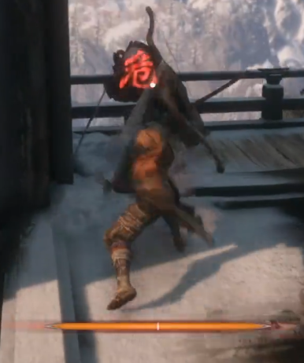
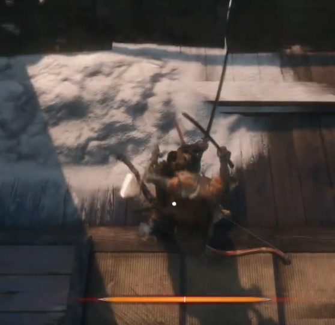
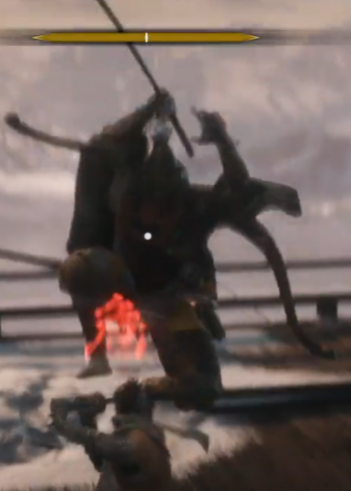
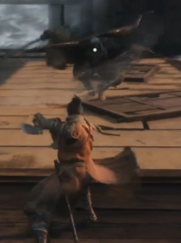
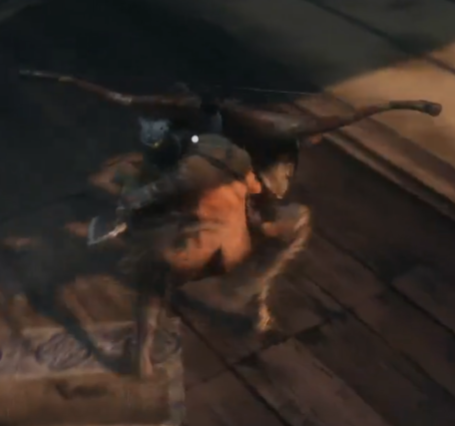

# 弦一郎动作分析

### 蓄力刺

蓄力大约2-3秒后进行一次直刺。在蓄力过程中始终锁定目标，刺击无修正。全程霸体。可作为接近技。

### 蓄力斩

蓄力大约1秒后进行一个旋转斩击。蓄力过程中锁定目标，斩击开始后无修正。全程霸体。

### 下落刺

靠近目标并起跳，随后进行一个快速的下落刺击，大约1秒。起跳前锁定目标，起跳后无修正。全程霸体。可作为接近技。

### 后跳横扫

进行一个快速的小跳横扫，大约1秒，无修正，带少量向后拉开的位移。可作为拉开技。

### 绕后投技

快速绕向目标侧后方，接近后发动投技。绕后的时候无霸体但速度很快。可作为接近技。

### 后撤步

快速后撤一段距离。

### 跳劈接蓄力斩

进行一个跳劈，大约2秒滞空时间。之后可接一个蓄力斩。可作为接近技。

### 后撤弓箭

快速后撤以后用弓箭攻击。

### 三连斩

三连的纵斩。每一刀有大约0.5秒的蓄力动作，之后的斩击本身很快。

### 蓄力横扫

三连纵斩里的最后一刀可能演变为一个蓄力的横扫斩。

### 追身纵斩

当目标退后的时候进行一个快速的翻滚接纵劈。

### 蓄力大跳劈

进行一个明显的蓄力（大约2秒），之后带一个完全追踪的跳劈。三阶段带打雷。

# 总结

弦一郎的战斗主要就是突进，回撤和接近之后危技能的循环。变招主要就是连击的最后一刀的动作和时机，危招的选择，以及回撤的时机。复刻的主要思路是首先实现进攻（危招）->回撤->突进的循环。之后实现在不同血量转阶段，切换动作。

# 想法

1. AI应当支持分阶段，在不同阶段解锁不同动作，或者动作组合。
2. AI应当有一个绕着目标转的指令作为对峙时候的动作。在AI到达Ticket位置之后，可以以目标为圆心，一定距离为半径进行慢速圆周运动。
3. AI应当可以进行组合技，并且组合技在不同阶段可以切换。
4. AI的技能应当可以按距离选择。
5. AI的技能应当可以按玩家动作选择。
6. AI的技能应当可以进行随机组合，比如三连斩的最后一刀可以换成不同的动作。
7. AI的技能衔接应当有一定规律。

# 实现
1. 单位速度实时调整。
2. 绕目标运动功能，包括固定距离和逐渐接近两种模式。可调整单次运动最小时间，最大时间，绕后目标位置。
3. 后撤功能。
4. 硬直系统改进：
    - 如果攻击达不到硬直要求，就会积累硬直条，硬直条满后出硬直。
    - 硬直保护，硬直以后进入一定时间的保护。